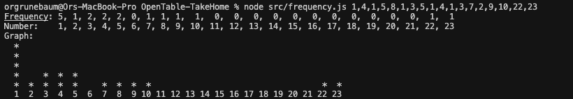

# OpenTable take home assignment: Number Frequency & Graph

## Overview
This project calculates the frequency of numbers in a list and displays the results in both tabular and graphical formats. It is implemented in JavaScript and includes unit tests for code quality.

## Features
- Calculates the frequency of each number in a given list.
- Outputs both the frequency and the corresponding numbers (from min to max in the list).
- Bonus: Renders a vertical bar graph of the frequencies.
- Includes comprehensive unit tests using Jest.

Additionally, I added comments on my logic and how I got to my solution. 

## Usage

### 1. Command Line
You can run the program from the command line and pass a comma-separated list of numbers as an argument:

```bash
node src/frequency.js 1,4,1,5,8,1,3,5,1,4,1,3,7,2
```

replace the numbers with whichever numbers you want to run in the array.

**Example Output:**
```
Frequency: 5, 1, 2, 2, 2, 0, 1, 1
Number:    1, 2, 3, 4, 5, 6, 7, 8
Graph:
 *              
 *              
 *              
 *   * * *      
 * * * * *   * *
 1 2 3 4 5 6 7 8
```



### 2. Programmatic Usage
You can import and use the functions in your own JavaScript code:

```js
const { calculateNumberFrequency, renderFrequencyGraph } = require('./src/frequency');

const input = [1, 4, 1, 5, 8, 1, 3, 5, 1, 4, 1, 3, 7, 2];
const { frequency, numbers } = calculateNumberFrequency(input);
console.log(frequency, numbers);
console.log(renderFrequencyGraph({ frequency, numbers }));
```

## Running Tests
This project uses [Jest](https://jestjs.io/) for unit testing. To run the tests:

```bash
npm test
```

## File Structure
- `src/frequency.js` - Main logic for frequency calculation and graph rendering
- `test/frequency.test.js` - Unit tests for all features
- `README.md` - This file

## Notes
- The graph output aligns numbers and stars for better readability.
- The program handles edge cases such as empty input and missing numbers in the range.